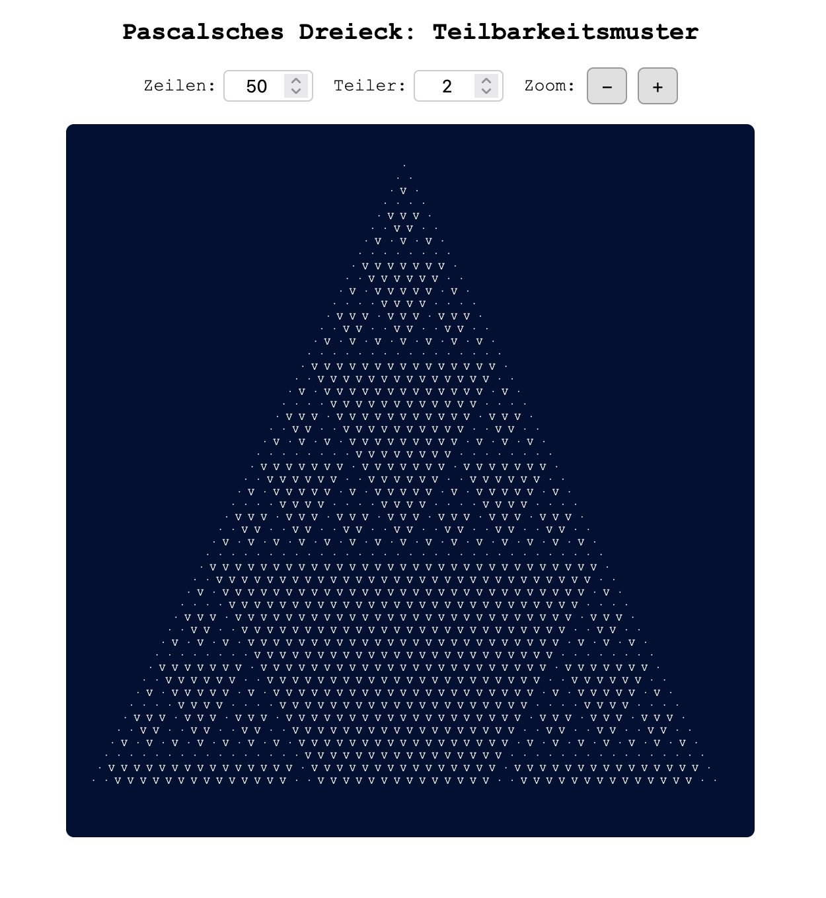

# Pascal's Triangle – Divisibility Patterns

🇩🇪 [Hier geht's zur deutschen Version.](./README.md)

An interactive, responsive web tool to visualize divisibility patterns with up to 5,000 rows in Pascal's Triangle.
Live version: [http://mathe.schwentker.de/pascal/index.html](http://mathe.schwentker.de/pascal/index.html)



## 📌 Features

* Interactive controls for number of rows and divisor
* Zoom function for large patterns
* Fast rendering of large patterns (up to 5,000 rows) using an efficient algorithm that avoids ${n \choose k}$
* Minimalist, fast and lightweight (no frameworks)
* Fully responsive (works on mobile, tablet, desktop)

## Mathematical Background

Pascal's Triangle is composed of integers arranged in rows where each number is the sum of the two numbers above it. Starting with 1 at the top (assuming 0s to the left and right), the triangle grows row by row. Example of the first 5 rows:

```
        1
      1   1
    1   2   1
  1   3   3   1
1   4   6   4   1
```

Each entry $a\_{n,k}$ at position $k$ in row $n$ is computed as:
$a_{n,k} = a_{n-1,k-1} + a_{n-1,k}$

Both row and position indices start at $0$. We conceptually add 0s beyond the borders. Alternatively, entries can be computed using the **binomial coefficient**:

```math
a_{n,k} = {n \choose k} = \frac{n!}{k!(n-k)!}
```

Binomial coefficients have many applications. In combinatorics, ${n \choose k}$ represents the number of ways to choose $k$ items from $n$ (ignoring order). In algebra, they are the coefficients in binomial expansion, e.g.,
$(a + b)^2 = 1\cdot a^2 + 2\cdot ab + 1\cdot b^2$,
which corresponds to row 2 in Pascal's Triangle. In general:
$(a + b)^n = \sum\_{k=0}^{n} {n \choose k} a^{n-k} b^k$

### Modulo Patterns in Pascal's Triangle

The app does not display the actual values in Pascal's Triangle but rather whether a value is divisible by a number $m$ (chosen by the user):

* `·` if not divisible ($a\_{n,k}\mod m \neq 0$)
* `V` if divisible ($a\_{n,k}\mod m = 0$)

For example, with *m = 2*, the famous **Sierpiński Triangle** emerges. For *m = 3, 5, 7*, other fractal-like **modular patterns** appear. These aren't just visually appealing but also [of interest in mathematical research](https://scholar.google.de/scholar?hl=de&as_sdt=0%2C5&q=Pascal%E2%80%99s+Triangle+modulo+m+&btnG=).

## Efficient Computation

To render patterns up to 5,000 rows, a computationally efficient algorithm is required. Directly using binomial coefficients ${n \choose k}$ is slow and memory-intensive due to factorials: $\(O(n!)\)$:

§${149 \choose 74} = 46,413,034,868,354,394,849,492,907,436,302,560,970,058,760$§

...is already in the range of $10^{44}$. Precomputing all values in a lookup table would need $\(O(n^2)\)$ space.

Thankfully, it's much simpler:
Pascal's Triangle entries can be calculated recursively, and the same applies for modulo $m$ values:

$$a_{n,k}\mod m = (a_{n-1,k-1}\mod m + a_{n-1,k}\mod m)\mod m$$

This is both fast and memory-efficient, as only small integers are handled. The modulo operation is **compatible with addition**: $(a + b) \mod m = \left( (a \mod m) + (b \mod m) \right) \mod m$

### Comparison of Computation Methods

| Method                        | Time Complexity  | Memory Usage      | Verdict        |
| ----------------------------- | ---------------- | ----------------- | -------------- |
| Factorial-based               | high $\(O(n!)\)$ | medium            | ❌ too slow     |
| Lookup table (precompute)     | fast             | high $\(O(n^2)\)$ | ❌ memory-heavy |
| **Iterative modulo approach** | **very low**     | **minimal**       | ✅ optimal      |

Although further speed-up is theoretically possible by exploiting symmetry $\({n \choose k} = {n \choose n - k}\)$, the gain is negligible and it would complicate the code.

## Technologies Used

* HTML5
* CSS3
* Vanilla JavaScript

## Author & License

Created by [Björn Schwentker](https://github.com/BSchwentker).
This project is licensed under the [MIT License](LICENSE).
Feel free to use, copy, modify, or distribute – even commercially – as long as credit is given.

## Sources & Credits

* Visualization idea inspired by:
  [Arndt Brünner – Pascalmod](https://www.arndt-bruenner.de/mathe/scripts/pascalmod.htm)
