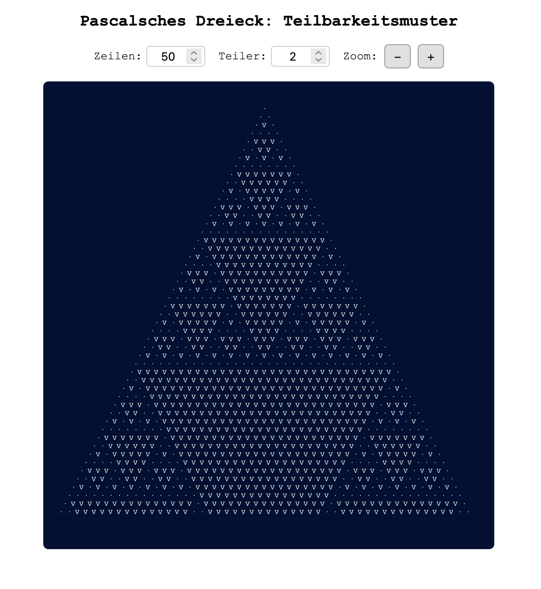

s# Pascalsches Dreieck – Teilbarkeitsmuster

Ein interaktives, responsives Web-Tool zur Visualisierung von Teilbarkeitsmustern im Pascalschen Dreieck.  
Dieses Projekt demonstriert, wie mathematische Einsichten zu eleganter und effizienter Webentwicklung führen können.

[http://mathe.schwentker.de/pascal/pascal.html](http://mathe.schwentker.de/pascal/pascal.html)



## 📌 Features

- Responsives Design (funktioniert auf Mobilgeräten, Tablets und Desktops)
- Interaktive Steuerung von Zeilenzahl und Teiler (Modulo)
- Zoom-Funktion für große Muster
- Overlay mit mathematischen Hintergrundinformationen
- Minimalistisch, performant und leichtgewichtig (keine Frameworks)

---

## 🧼 Mathematischer Hintergrund

Das Pascalsche Dreieck

> **aₙₖ = aₙ₋₁ₖ₋₁ + aₙ₋₁ₖ**


```
        1
      1   1
    1   2   1
  1   3   3   1
1   4   6   4   1
```

```
{n \choose k} = \frac{n!}{k!(n-k)!}
```

> Binomialkoeffizient:  
> "n über k" = n! / (k! × (n − k)!)


Wenn man diese Koeffizienten **modulo einer ganzen Zahl m** betrachtet, ergeben sich faszinierende Muster. Die Einträge werden dargestellt als:

- `·` wenn nicht durch *m* teilbar
- `V` wenn durch *m* teilbar

Es entsteht so z. B. bei *m = 2* das berühmte **Sierpinski-Dreieck**, bei *m = 3, 5, 7* weitere fraktalartige **modulare Muster**.

### 🔁 Effiziente Berechnung

Anstatt die Binomialkoeffizienten mit Fakultäten zu berechnen (was teuer und speicherintensiv wäre), nutzen wir die rekursive Eigenschaft des Pascalschen Dreiecks:

```
{n \choose k} = {n-1 \choose k-1} + {n-1 \choose k}
```

Diese Regel gilt auch **modulo m**:

```
{n \choose k} mod m = ({n-1 \choose k-1} mod m + {n-1 \choose k} mod m) mod m
```

So entsteht die rekursive Zeile-zu-Zeile-Berechnung mit extrem geringer Rechenlast und ohne vollständige Matrizenhaltung.

### 📊 Vergleich der Berechnungsansätze

| Methode                       | Rechenaufwand         | Speicherbedarf       | Bewertung       |
|------------------------------|------------------------|----------------------|-----------------|
| Direkte Berechnung mit Fakultäten | Hoch (n!)              | Mittel               | ❌ langsam       |
| Lookup-Tabelle (Precompute)  | Schnell                | Hoch (O(n²))         | ❌ speicherintensiv |
| **Iterative Modulo-Berechnung** | **Sehr gering**         | **Minimal**          | ✅ optimal       |

Diese Methode zeigt, wie mathematisches Nachdenken vor dem Programmieren nicht nur Klarheit, sondern auch Performance bringt.


---

## Beispiele für Modulo-Muster

- **m = 2**: Sierpinski-Dreieck
- **m = 3**: dreistrahliges fraktales Muster
- **m = 5**: fünfstrahliges symmetrisches Muster
- **m = 7**: komplexe rotationssymmetrische Struktur

Weitere Beispiele sind unter dem Begriff *Pascal’s Triangle modulo m* in der mathematischen Literatur zu finden.

---

## Technologien

- HTML5 (strukturierter Aufbau)
- CSS3 (Media Queries, Variablen, responsive Design)
- Vanilla JavaScript (modular, ohne Framework)

---

## 👤 Autor

  


---

## Autor & Lizenz

Erstellt von [Björn Schwentker](https://github.com/BSchwentker)

Dieses Projekt steht unter der [MIT License](LICENSE).  
Du darfst es kopieren, verändern, verwenden – auch kommerziell – solange du den ursprünglichen Autor nennst.

---

## Quellen & Dank

- Darstellung der Teilbarkeitsmuster inspiriert durch:  
  [Arndt Brünner – Pascalmod](https://www.arndt-bruenner.de/mathe/scripts/pascalmod.htm)

